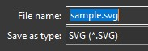
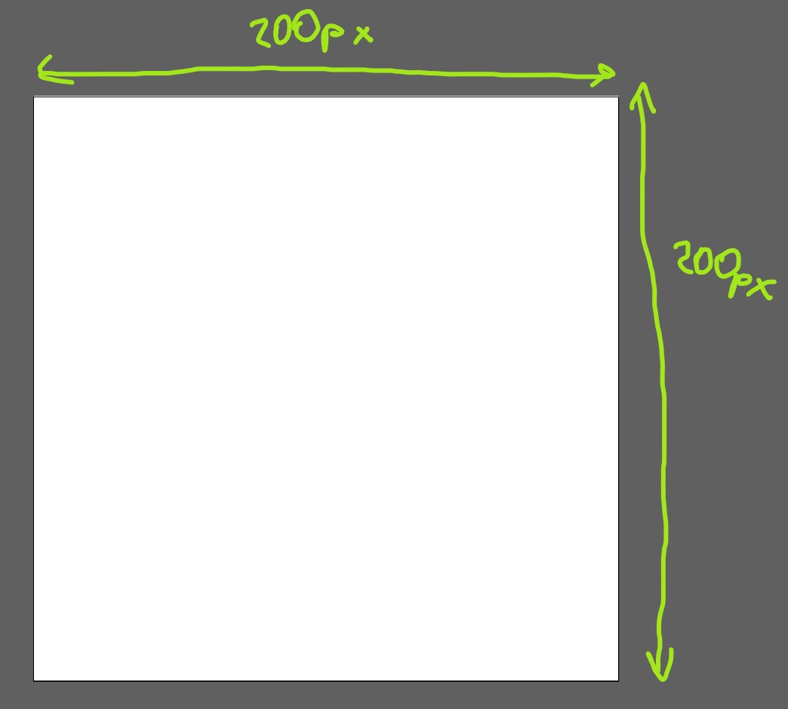
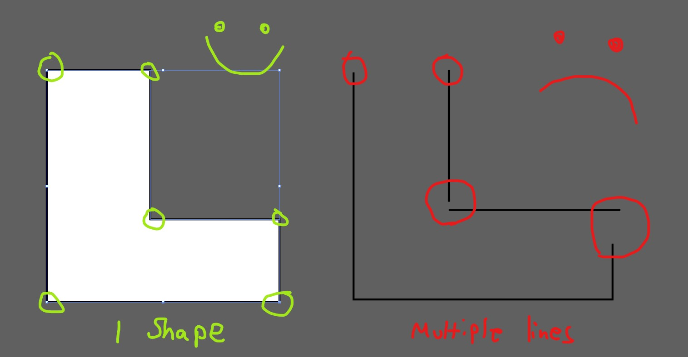
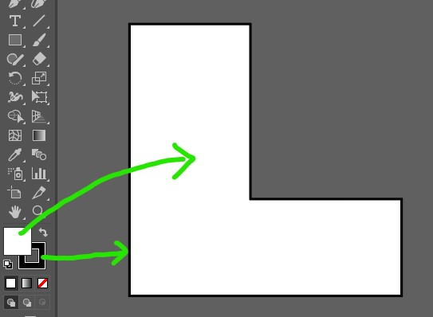
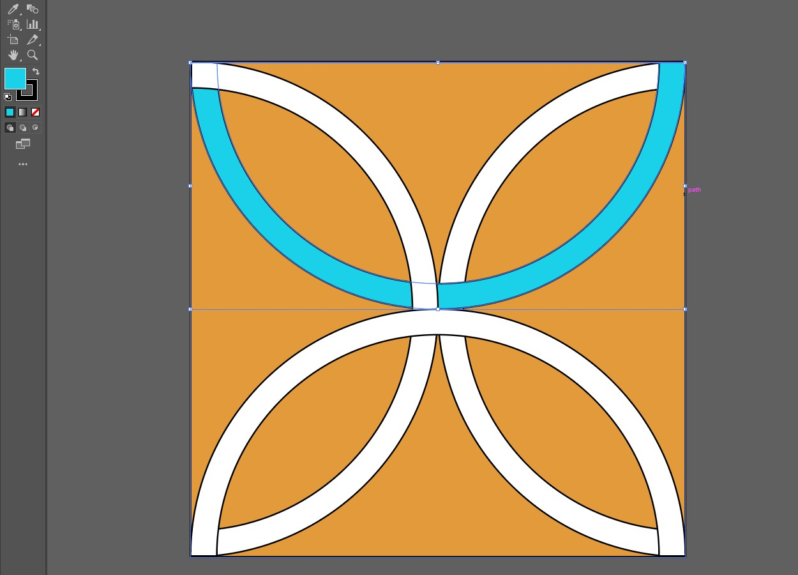
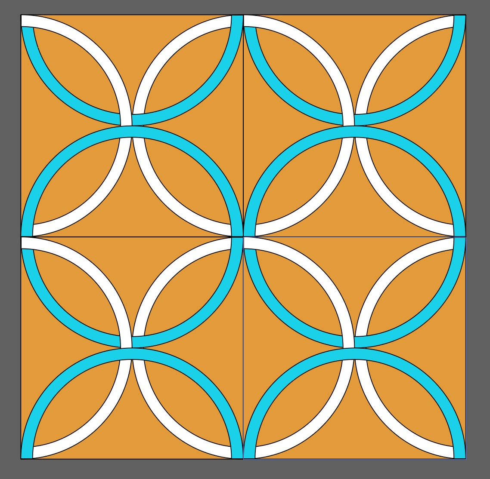
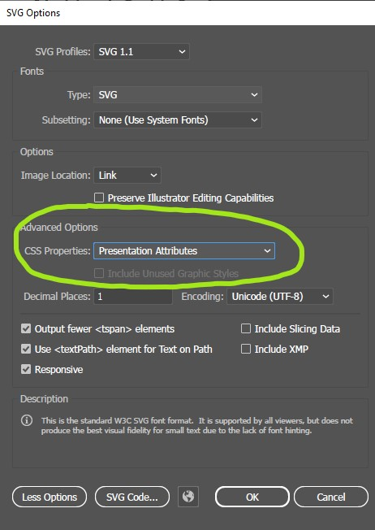
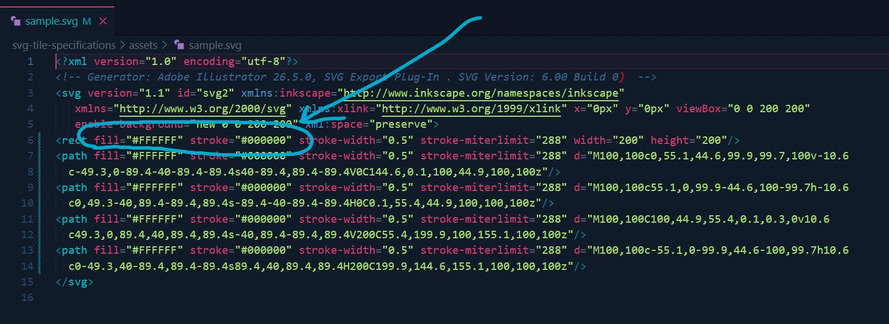

# Tile SVG Specifications

Here is a [Sample SVG file](assets/sample.svg) to download and study.

## Specifications

### `.svg` file extension

File must be a `.svg` file and contain vectors (no raster graphics)

### Artboard must be square
Mine are `200x200px`, but any size should be fine as long as it's square.

### All must be shapes must be closed
Use closed shapes only and independant of each other; no groups.

### All shapes should have a white fill and 0.5px black stroke.

### Testing
You can use illustrator to test that the pieces of the tile will work in the React app by giving them a fill color.

It's also a good idea to test that your pattern makes sense by copy/pasting your design to make a 2x2 grid.

### CSS Properties
__Very important:__ CSS Properties need to be set to "Presentation Attributes" when saving in Adobe Illustrator

The reason for this is that illustrator will add the shapes' styles inline on the SVG elements rather than using classes inside a `<style>` tag.

